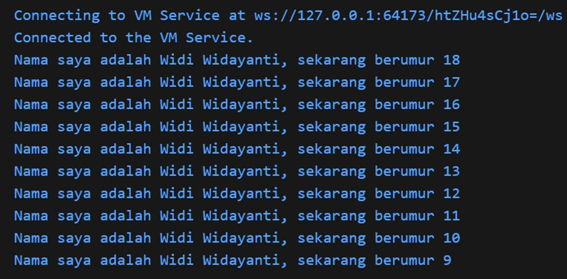
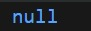

# Laporan Praktikum #02 - Pemrograman Dart

## Identitas Mahasiswa

| Atribut | Nilai                        |
| ------- | ---------------------------- |
| Nama    | Widi Widayanti               |
| NIM     | 244107060029                 |
| Kelas   | SIB - 2D                     |

---

## Tugas Praktikum 2

### Soal 1: Modifikasi Kode Dart
Modifikasilah kode pada baris 3 di VS Code atau Editor Code favorit Anda berikut ini agar mendapatkan keluaran (output) sesuai yang diminta!

**Hasil Output:**

---

### Soal 2: Pentingnya Memahami Dart
Mengapa sangat penting memahami Dart sebelum menggunakan framework Flutter?
* **Dasar Framework:** Flutter dibangun sepenuhnya menggunakan Dart, sehingga logika aplikasi bergantung pada pemahaman bahasa ini.
* **Manajemen State:** Memahami variabel dan objek di Dart krusial untuk mengelola tampilan aplikasi yang dinamis.
* **Efisiensi:** Mempercepat proses debugging karena kita memahami alur kode dari akarnya.

---

### Soal 3: Rangkuman Materi
Poin-poin penting dari materi codelab:
* **Null Safety:** Menjamin keamanan variabel dari nilai null untuk mencegah aplikasi crash.
* **Late Variable:** Memungkinkan deklarasi variabel non-nullable tanpa nilai awal (inisialisasi menyusul).
* **Type Inference:** Kemampuan Dart mendeteksi tipe data secara otomatis menggunakan `var`.

---

### Soal 4: Null Safety vs Late Variable

**1. Contoh Eksekusi Null Safety:**

**2. Contoh Eksekusi Late Variable:**

---
*Laporan ini disusun sesuai dengan format tugas Praktikum Pemrograman Mobile.*