# Laporan Praktikum #03 | Pengantar Bahasa Pemrograman Dart - Bagian 2

## Identitas Mahasiswa

| Atribut | Nilai                        |
| ------- | -----                        |
| Nama    | Widi Widayanti               |
| NIM     | 244107060029                 |
| Kelas   | SIB-2D                       |
---

# Tugas Praktikum 3

# Soal 1
Silakan selesaikan Praktikum 1 sampai 3, lalu dokumentasikan berupa screenshot hasil pekerjaan beserta penjelasannya!

## Praktikum 1
### Langkah 1:

Ketik atau salin kode program berikut ke dalam fungsi `main()`.

```dart
String test = "test2";
if (test == "test1") {
   print("Test1");
} else If (test == "test2") {
   print("Test2");
} Else {
   print("Something else");
}

if (test == "test2") print("Test2 again");
```

### Langkah 2:

Silakan coba eksekusi (Run) kode pada langkah 1 tersebut. Apa yang terjadi? Jelaskan!

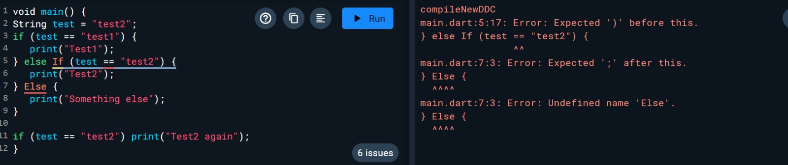

Kode mengalami error pada penulisan If dan Else (huruf kapital). Dart bersifat case-sensitive. Kata kunci alur kontrol harus ditulis dengan huruf kecil (if dan else) agar dikenali oleh kompilator.

### Langkah 3:

Tambahkan kode program berikut, lalu coba eksekusi (Run) kode Anda.

```dart
String test = "true";
if (test) {
   print("Kebenaran");
}
```

Apa yang terjadi ? Jika terjadi error, silakan perbaiki namun tetap menggunakan if/else

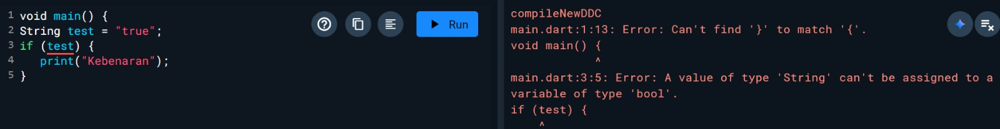

Error terjadi karena variabel test yang bertipe String digunakan langsung sebagai kondisi if(test). Di Dart, kondisi if wajib berupa nilai boolean (true/false). Perbaikannya adalah dengan melakukan perbandingan eksplisit, contohnya: if (test == "true").
Perbaikannya

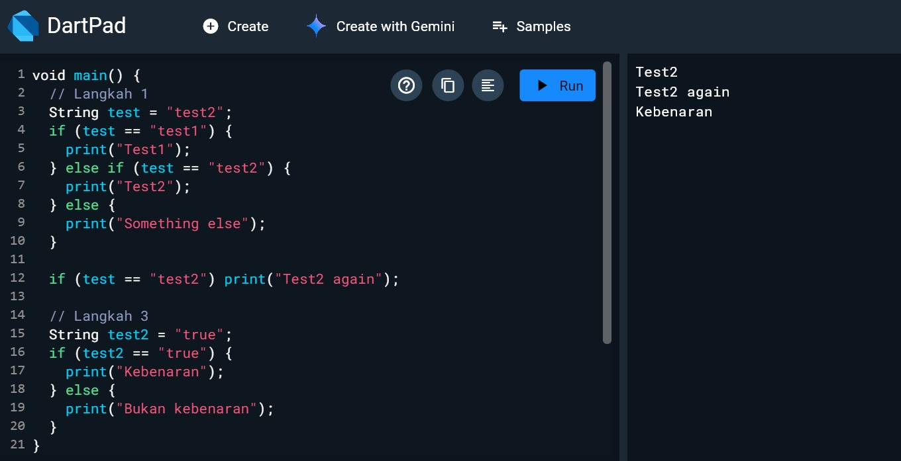

Maka akan muncul 'Kebenaran' sebagai output

## Praktikum 2
### Langkah 1:

Ketik atau salin kode program berikut ke dalam fungsi `main()`.

```dart
while (counter < 33) {
  print(counter);
  counter++;
}
```

### Langkah 2:

Silakan coba eksekusi (Run) kode pada langkah 1 tersebut. Apa yang terjadi? Jelaskan! Lalu perbaiki jika terjadi error.

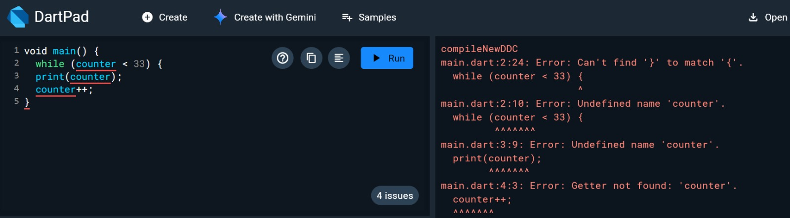

Terjadi error karena variabel counter belum dideklarasikan sebelum digunakan di dalam loop while

Perbaikan variabel harus dideklarasikan dan diinisialisasi nilainya (misal: int counter = 0;) sebelum digunakan dalam operasi logika perulangan.

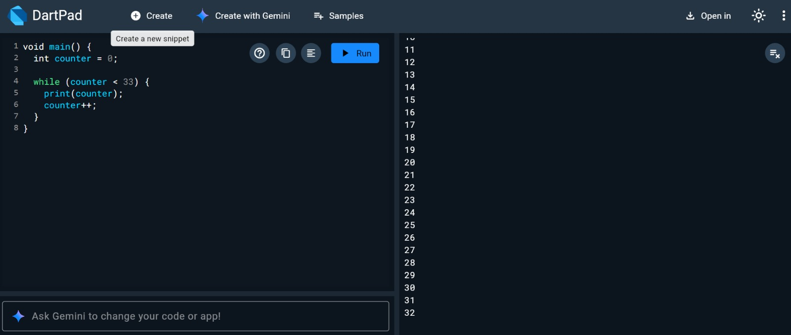

### Langkah 3:

Tambahkan kode program berikut, lalu coba eksekusi (Run) kode Anda.

```dart
do {
  print(counter);
  counter++;
} while (counter < 77);
```

Apa yang terjadi ? Jika terjadi error, silakan perbaiki namun tetap menggunakan *do-while*.

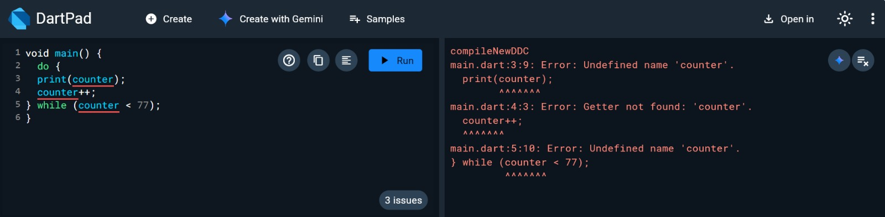

Errornya sama seperti sebelumnya, variabel counter harus dipastikan sudah tersedia di dalam lingkup (scope) fungsi main.

Perbedaan utama do-while adalah blok kode dijalankan minimal satu kali sebelum kondisi diperiksa di akhir.

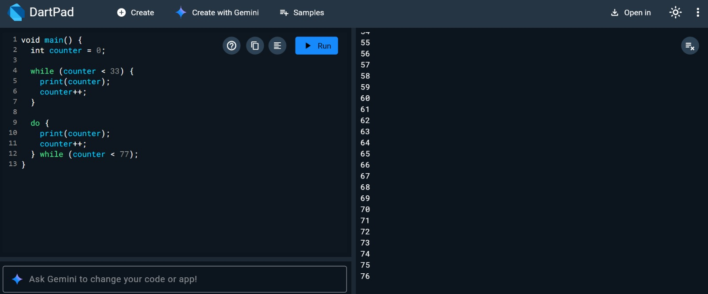

## Praktikum 3
### Langkah 1:

Ketik atau salin kode program berikut ke dalam fungsi `main()`.

```dart
for (Index = 10; index < 27; index) {
  print(Index);
}
```

### Langkah 2:

Silakan coba eksekusi (Run) kode pada langkah 1 tersebut. Apa yang terjadi? Jelaskan! Lalu perbaiki jika terjadi error.

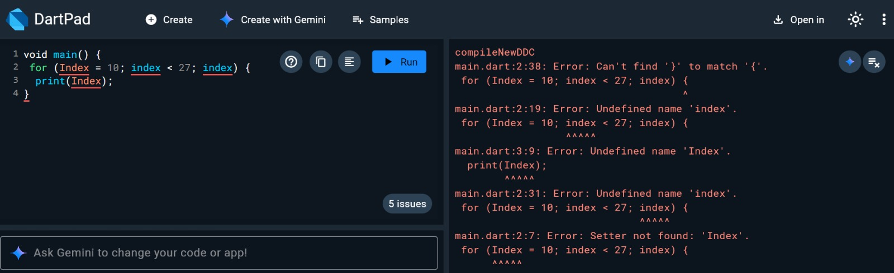

Variabel index tidak memiliki tipe data, penulisan nama variabel tidak konsisten (kapital/kecil), dan tidak ada ekspresi increment (index++).

Perbaikannya yaitu menambahkan tipe data pada index, mengganti penulisan 'Index' menjadi 'index', serta menambahkan ++ pada index di akhir baris 2.


### Langkah 3:

Tambahkan kode program berikut di dalam *for-loop*, lalu coba eksekusi (Run) kode Anda.

```dart
If (Index == 21) break;
Else If (index > 1 || index < 7) continue;
print(index);
```

Apa yang terjadi ? Jika terjadi error, silakan perbaiki namun tetap menggunakan *for* dan *break-continue*.

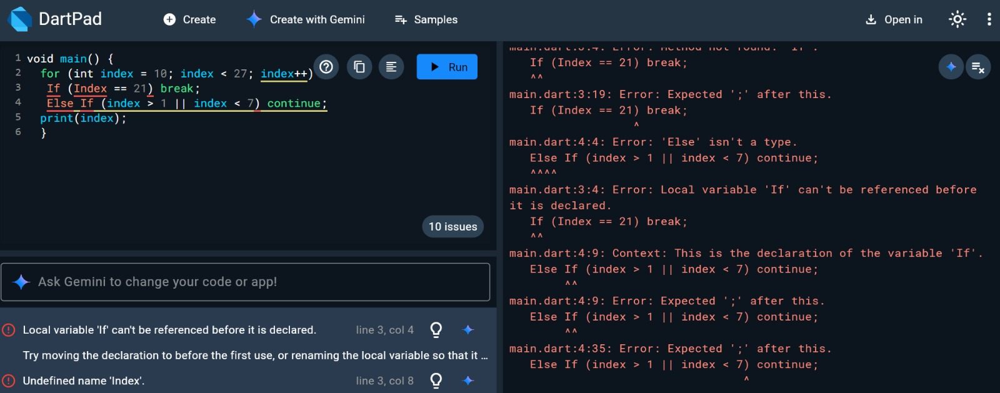

Terjadi error karena penulisan If dan Else If menggunakan huruf kapital, padahal Dart bersifat case-sensitive sehingga harus menggunakan huruf kecil ('if' dan 'else if'), terdapat warning karena pernyataan if dan else if tidak dibungkus dengan kurung kurawal {}, Selain itu penggunaan operator || membuat kondisi selalu TRUE karena index > 1 sudah pasti terpenuhi saat index dimulai dari 10, sehingga perintah print tidak pernah dijalankan

Perbaikannya menggunakan operator && (AND) dan huruf kecil pada if/else memastikan angka 10–20 tercetak dengan benar sebelum dihentikan oleh break.

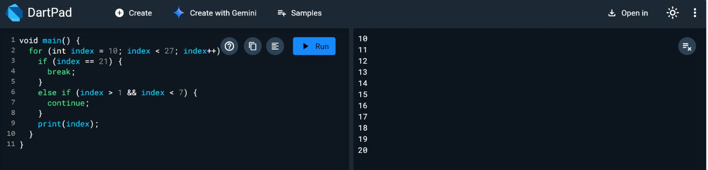

# Soal 2
Buatlah sebuah program yang dapat menampilkan bilangan prima dari angka 0 sampai 201 menggunakan Dart. Ketika bilangan prima ditemukan, maka tampilkan nama lengkap dan NIM Anda.

Code Program

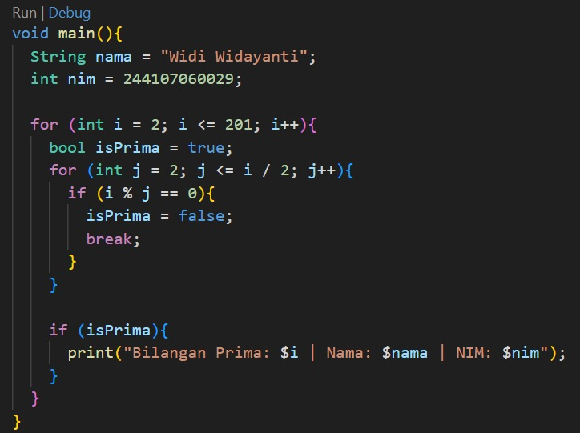

Outputnya

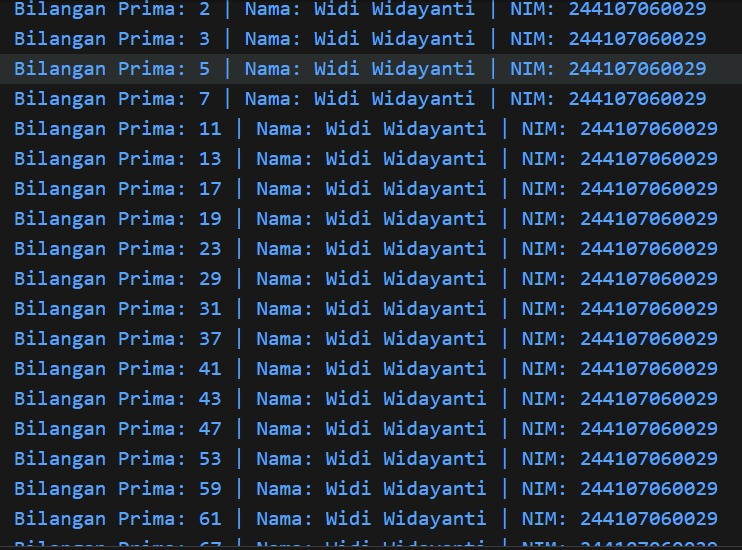