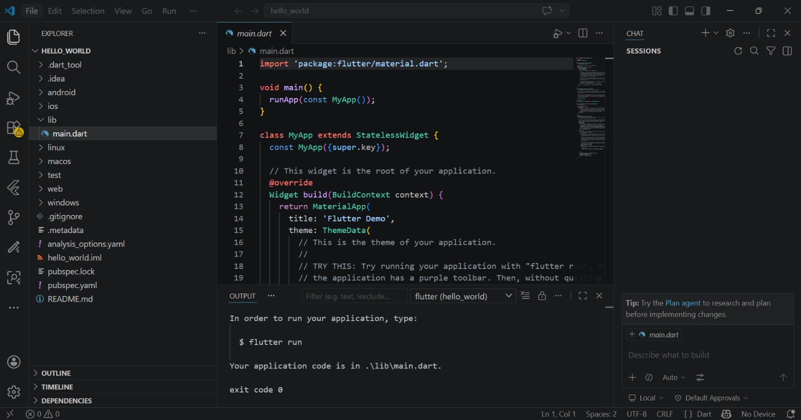
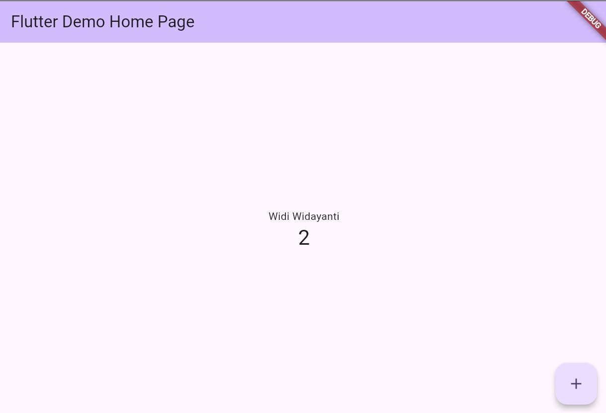
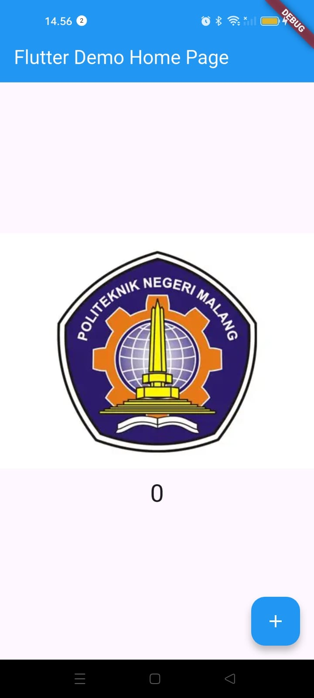
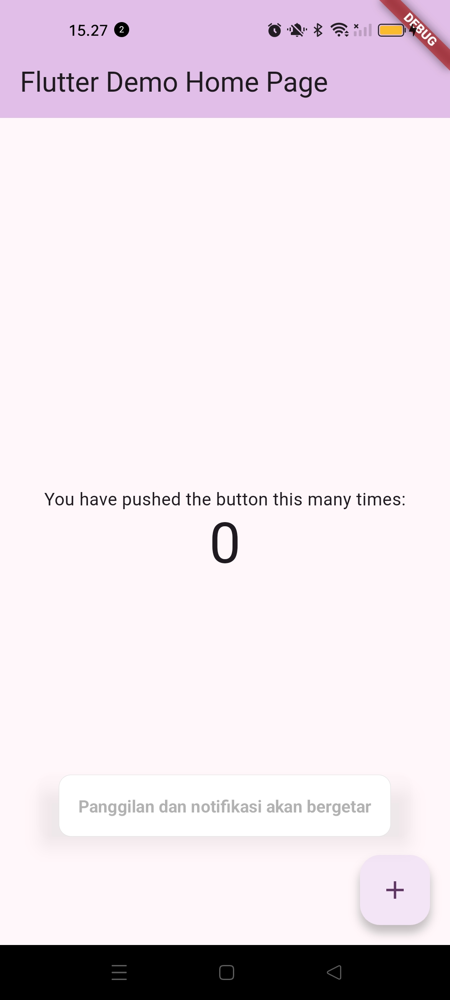
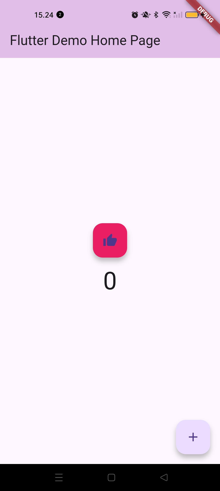
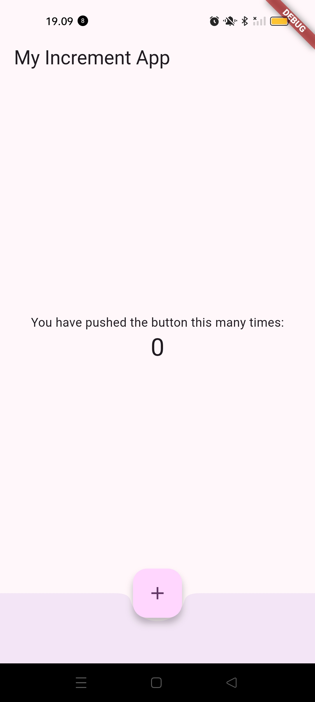

# Laporan Praktikum #05 | Aplikasi Pertama dan Widget Dasar Flutter

## Identitas Mahasiswa
| Atribut | Nilai |
| --- | --- |
| Nama | Widi Widayanti |
| NIM | 244107060029 |
| Kelas | SIB-2D |

---

# Tugas Praktikum 5

## Soal 1
Selesaikan Praktikum 1 sampai 5, lalu dokumentasikan dan push ke repository Anda!

### Praktikum 1

### Praktikum 3

### Praktikum 4
**Langkah 1: Text Widget**

**Langkah 2: Image Widget**

### Praktikum 5
**Langkah 1: Cupertino Button dan Loading Bar**

**Langkah 2: Floating Action Button (FAB)**

---

## Soal 2: Running on Physical Device

---

## Soal 3: Widget Terpisah (Langkah 3 - 6)

**Langkah 3: Scaffold Widget**

**Langkah 4: Dialog Widget**

**Langkah 5: Input dan Selection Widget**

**Langkah 6: Date and Time Pickers**

---

## Soal 4: Codelabs Result
