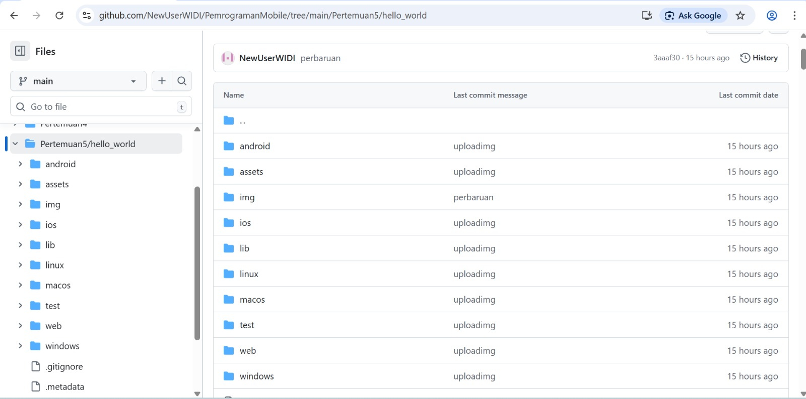
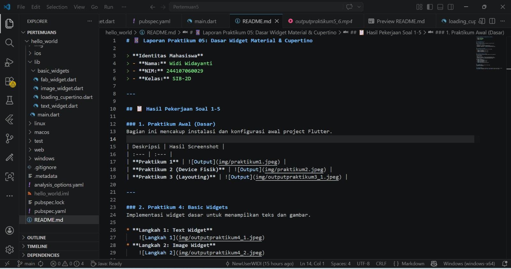
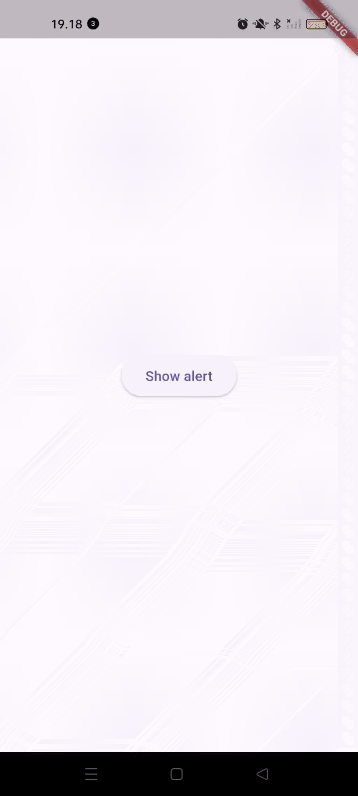
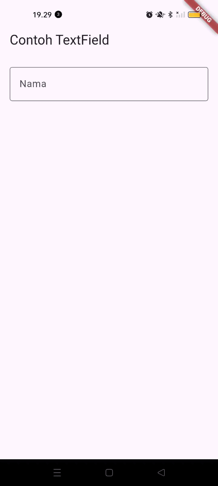
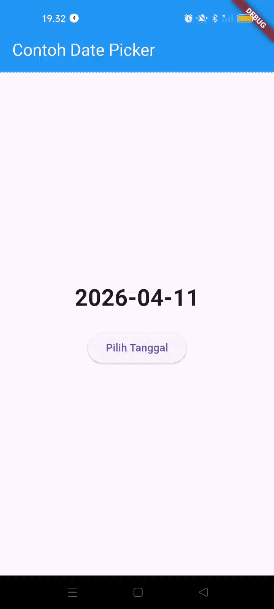
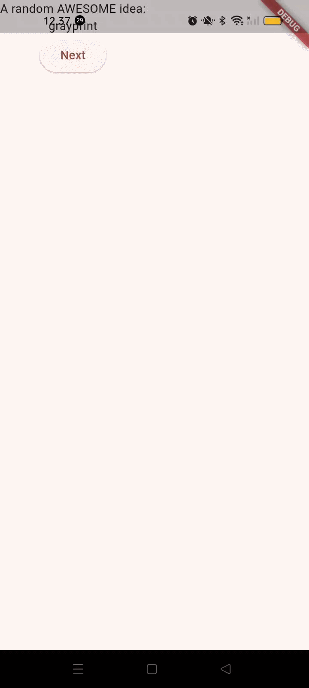
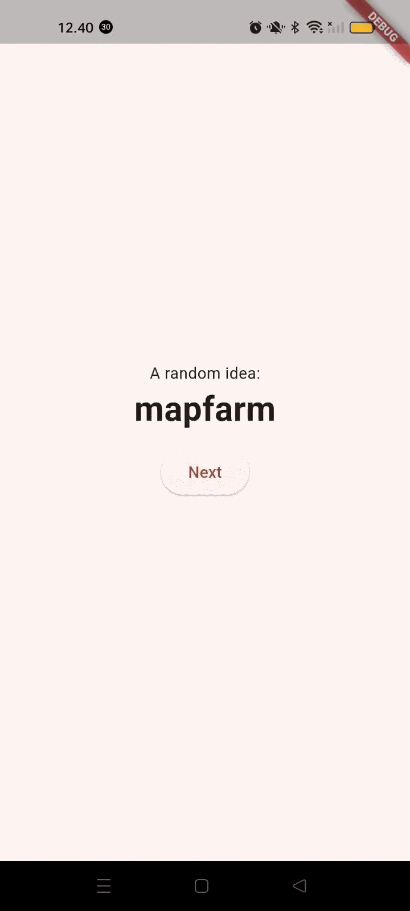
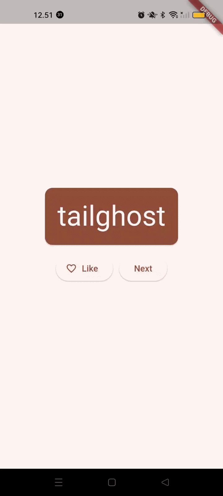
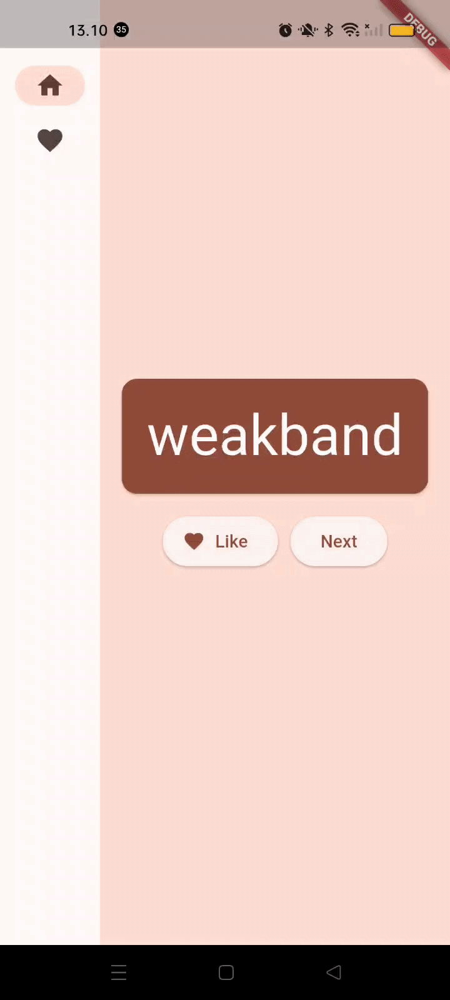
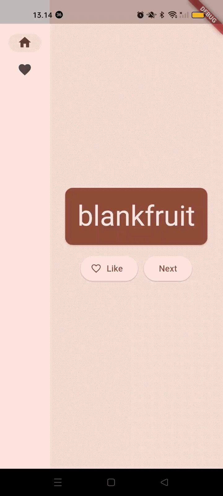

# Laporan Praktikum 05: Dasar Widget Material & Cupertino

> **Identitas Mahasiswa**
> - **Nama:** Widi Widayanti
> - **NIM:** 244107060029
> - **Kelas:** SIB-2D

---

## Hasil Pekerjaan Soal 1-5

### 1. Praktikum Awal (Dasar)
Bagian ini mencakup instalasi dan konfigurasi awal project Flutter.

| Deskripsi | Hasil Screenshot |
| :--- | :--- |
| **Praktikum 1** |  |
| **Praktikum 2 (Device Fisik)** |  |
| **Praktikum 3 (Layouting)** |  |

---

### 2. Praktikum 4: Basic Widgets
Implementasi widget dasar untuk menampilkan teks dan gambar.

* **Langkah 1: Text Widget**
    
* **Langkah 2: Image Widget**
    

---

### 3. Praktikum 5: Material & Cupertino
Eksperimen dengan desain spesifik Android (Material) dan iOS (Cupertino).

**A. Komponen Utama**
| Widget | Screenshot |
| :--- | :--- |
| **Cupertino & Loading** |  |
| **Floating Action Button** |  |
| **Scaffold Layout** |  |

**B. Widget Interaktif**
* **Langkah 4: Dialog Widget**
    
* **Langkah 5: Input Widget**
    
* **Langkah 6: Date Picker**
    

---

### 4. Codelabs Result
Hasil pengerjaan *Codelabs: Your first Flutter app*.

Bagian ini berisi laporan progres pengerjaan Codelabs untuk membangun aplikasi "Namer App" menggunakan Flutter.

### 1. Deskripsi Proyek
Aplikasi ini merupakan aplikasi generator nama acak yang menggunakan konsep *State Management* dengan `Provider`. Aplikasi ini memungkinkan pengguna untuk menghasilkan kata-kata unik, menyukainya (Like), dan melihat daftar favorit di halaman yang berbeda.

### 2. Langkah-Langkah Pengerjaan & Hasil

| Tahap | Penjelasan | Hasil (Screenshot/Video) |
| :--- | :--- | :--- |
| **Setup & Basic UI** | Mengonfigurasi `pubspec.yaml` untuk package `english_words` & `provider`, serta membuat struktur dasar `main.dart`. |  |
| **Adding a Button** | Menambahkan logic `getNext` untuk mengacak kata dan menambahkan tombol "Next" pada tampilan utama. |  |
| **Refactoring & Styling** | Mengekstrak widget `BigCard` untuk memisahkan logika UI dan memberikan tema warna `deepOrange` serta tipografi yang lebih besar. |  |
| **Add Navigation Rail** | Menggunakan `LayoutBuilder` untuk membuat *sidebar* yang responsif (bisa lebar/kecil otomatis) sesuai ukuran layar. |  |
| **Add Favorites Page** | Mengganti `Placeholder` dengan widget `ListView` untuk menampilkan daftar kata yang telah di-like oleh pengguna. |  |

---

## Catatan Tambahan
Seluruh widget pada praktikum 5 (Langkah 3-6) telah dipisahkan ke dalam file tersendiri di folder `basic_widgets` dan dipanggil melalui `import` pada `main.dart` sesuai instruksi tugas.