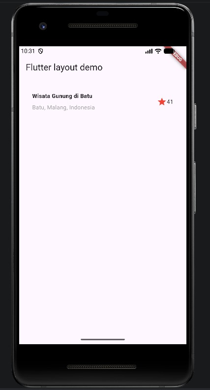
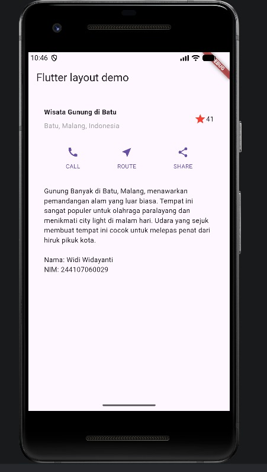
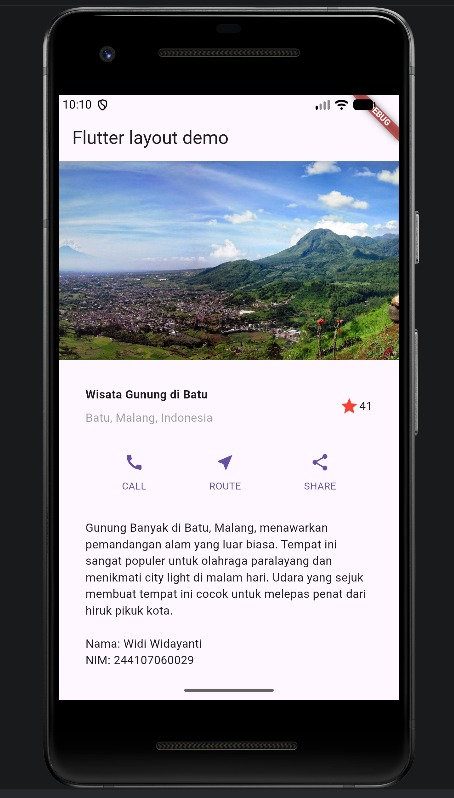
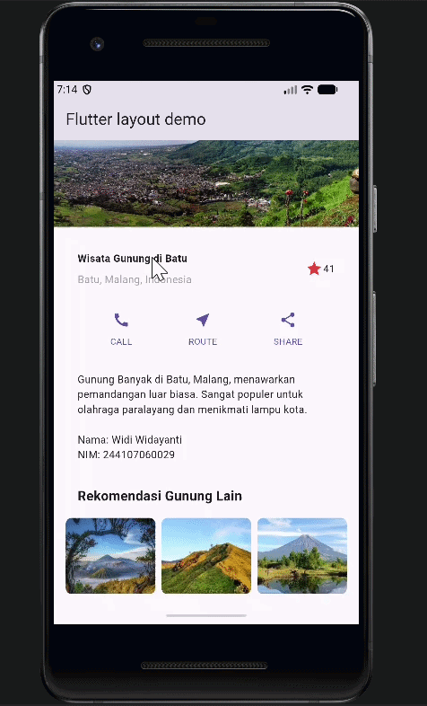
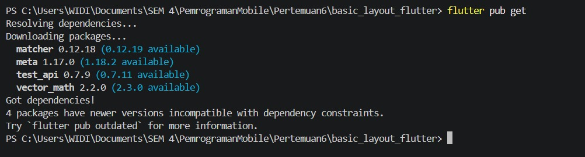
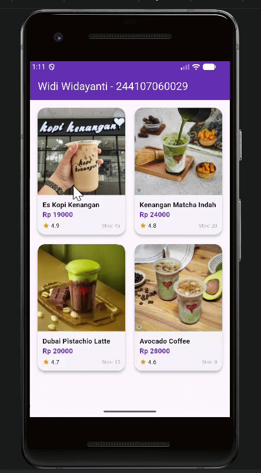

# Laporan Praktikum #06 | Layout dan Navigasi

## Identitas Mahasiswa
- **Nama**: Widi Widayanti
- **NIM**: 244107060029
- **Kelas**: SIB-2D

---

## 1. Proyek Utama: layout_flutter

Bagian ini mendokumentasikan pembangunan layout halaman informasi objek wisata secara bertahap.

### Langkah 1: Implementasi Title Section
Menyusun elemen judul, lokasi, dan rating bintang menggunakan widget `Row` dan `Column`.
- **Output**: 

### Langkah 2: Implementasi Button Section
Membuat baris tombol interaktif (Call, Route, Share) menggunakan fungsi pembantu agar kode lebih modular.
- **Output**: 

### Langkah 3: Implementasi Text Section
Menambahkan deskripsi panjang mengenai objek wisata dengan pengaturan padding agar teks nyaman dibaca.
- **Output**: 

### Langkah 4: Final Layout & Image Section
Menggabungkan seluruh section dan menambahkan gambar utama di bagian paling atas sebagai elemen visual kunci.
- **Output Final**: 

### Tugas: Menambahkan Recommendation Section
Menambahkan section "Rekomendasi Gunung Lain" menggunakan `Row` dan `Expanded` untuk menampilkan pilihan tempat lain.
- **Output**: 

---

## 2. Proyek Lanjutan: basic_layout_flutter (Katalog Kopi Kita)

### Langkah 1: Update Model Data
Menambahkan atribut `foto`, `stok`, dan `rating` pada class `Item` agar data lebih dinamis.

### Langkah 2: Implementasi GridView 2 Kolom
Mengubah tampilan daftar produk dari `ListView` menjadi `GridView.builder` agar terlihat seperti marketplace profesional.
- 
### Langkah 3: Navigasi & Hero Animation
Menambahkan widget `Hero` pada gambar produk untuk menciptakan efek transisi yang halus saat berpindah ke halaman detail.
- 

### Langkah 4: Detail Produk (ItemPage)
Menyusun halaman detail yang menampilkan informasi harga, rating bintang, dan ketersediaan stok.
- 

---

## 3. Implementasi Modern Navigation (GoRouter)

### Konfigurasi Router
Membuat rute deklaratif pada file `lib/router/go_router.dart` dan menghubungkannya dengan `MaterialApp.router`.
- **Output**: 

### Hasil Akhir
- **Output**: 

---

## Catatan Troubleshooting
1. **Asset Path**: Memastikan folder `images` sudah terdaftar dengan benar di `pubspec.yaml`.
2. **Modular Code**: Memecah widget menjadi komponen kecil agar kode lebih bersih.
3. **Arguments**: Menggunakan `state.extra` pada GoRouter untuk pengiriman data objek antar halaman.