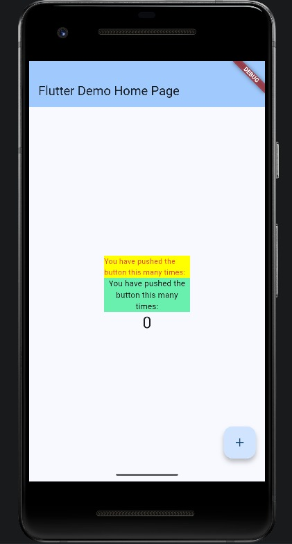

# Laporan Praktikum #07 | Manajemen Plugin

## Identitas Mahasiswa
| Atribut | Nilai |
| :--- | :--- |
| **Nama** | Widi Widayanti |
| **NIM** | 244107060029 |
| **Kelas** | SIB-2D |

---

# Soal 1

## Implementasi Kode

### `red_text_widget.dart`

```dart
import 'package:flutter/material.dart';
import 'package:auto_size_text/auto_size_text.dart';

class RedTextWidget extends StatelessWidget {
  final String text;

  const RedTextWidget({Key? key, required this.text}) : super(key: key);

  @override
  Widget build(BuildContext context) {
    return AutoSizeText(
      text,
      style: const TextStyle(color: Colors.red, fontSize: 14),
      maxLines: 2,
      overflow: TextOverflow.ellipsis,
    );
  }
}
```

### `main.dart`

```dart
import 'package:flutter/material.dart';
import 'package:flutter_plugin_pubdev/red_text_widget.dart';

void main() {
  runApp(const MyApp());
}

class MyApp extends StatelessWidget {
  const MyApp({super.key});

  @override
  Widget build(BuildContext context) {
    return MaterialApp(
      title: 'Flutter Demo',
      theme: ThemeData(
        colorScheme: ColorScheme.fromSeed(seedColor: Colors.deepPurple),
      ),
      home: const MyHomePage(title: 'Flutter Demo Home Page'),
    );
  }
}

class MyHomePage extends StatefulWidget {
  const MyHomePage({super.key, required this.title});

  final String title;

  @override
  State<MyHomePage> createState() => _MyHomePageState();
}

class _MyHomePageState extends State<MyHomePage> {
  int _counter = 0;

  void _incrementCounter() {
    setState(() {
      _counter++;
    });
  }

  @override
  Widget build(BuildContext context) {
    return Scaffold(
      appBar: AppBar(
        backgroundColor: Theme.of(context).colorScheme.inversePrimary,
        title: Text(widget.title),
      ),
      body: Center(
        child: Column(
          mainAxisAlignment: MainAxisAlignment.center,
          children: <Widget>[
            Container(
              color: Colors.yellowAccent,
              width: 50,
              child: const RedTextWidget(
                text: 'Seorang Legendary Person and Fisher on Kediri City:',
              ),
            ),
            Container(
              color: Colors.greenAccent,
              width: 100,
              child: const Text(
                'Berumur 21 Tahun, Lahir di Kediri'
              ),
            )
          ],
        ),
      ),
      floatingActionButton: FloatingActionButton(
        onPressed: _incrementCounter,
        tooltip: 'Increment',
        child: const Icon(Icons.add),
      ),
    );
  }
}
```

## Output

Tambahkan screenshot hasil aplikasi:



---

# Soal 2

## Jelaskan maksud dari langkah 2 pada praktikum tersebut!

Perintah:

    flutter pub add auto_size_text

Perintah tersebut digunakan untuk menambahkan package **auto_size_text** ke dalam proyek Flutter agar dapat digunakan untuk menampilkan teks dengan ukuran font yang menyesuaikan secara otomatis.

---

# Soal 3

## Jelaskan maksud dari langkah 5 pada praktikum tersebut!

Kode:

    final String text;

    const RedTextWidget({Key? key, required this.text}) : super(key: key);

Penjelasan:

- `final String text;` → Variabel teks yang tidak dapat diubah
- `required this.text` → Parameter wajib saat membuat widget
- `Key? key` → Parameter opsional
- `super(key: key)` → Mengirim key ke parent class

---

# Soal 4

## Pada langkah 6 terdapat dua widget yang ditambahkan, jelaskan fungsi dan perbedaannya!

### Container 1

    Container(
       color: Colors.yellowAccent,
       width: 50,
       child: const RedTextWidget(
         text: 'You have pushed the button this many times:',
       ),
    )

Fungsi:
- Menggunakan custom widget **RedTextWidget**
- Teks berwarna merah
- Mendukung auto-resize
- Maksimal 2 baris dengan ellipsis (...)

### Container 2

    Container(
        color: Colors.greenAccent,
        width: 100,
        child: const Text(
          'You have pushed the button this many times:',
        ),
    )

Fungsi:
- Menggunakan widget **Text** bawaan
- Tidak memiliki fitur auto-resize
- Warna teks default

### Perbedaan

Container pertama menggunakan custom widget dengan fitur auto-resize, sedangkan container kedua menggunakan widget bawaan tanpa fitur tersebut.

---

# Soal 5

## Jelaskan maksud dari tiap parameter dalam plugin `auto_size_text`!

- **text** → Teks yang ditampilkan
- **style** → Mengatur tampilan teks
- **maxLines** → Maksimal jumlah baris
- **minFontSize** → Ukuran font minimum
- **maxFontSize** → Ukuran font maksimum
- **stepGranularity** → Tingkat perubahan ukuran font
- **presetFontSizes** → Daftar ukuran font tertentu
- **group** → Menyamakan ukuran font antar widget
- **textAlign** → Perataan teks
- **textDirection** → Arah teks
- **overflow** → Penanganan teks berlebih
- **softWrap** → Mengatur pembungkusan teks

---

# Soal 6

## Kumpulkan laporan praktikum Anda berupa link repository GitHub kepada dosen!

**Link Repository GitHub:**  
_(Tambahkan link repository di sini)_